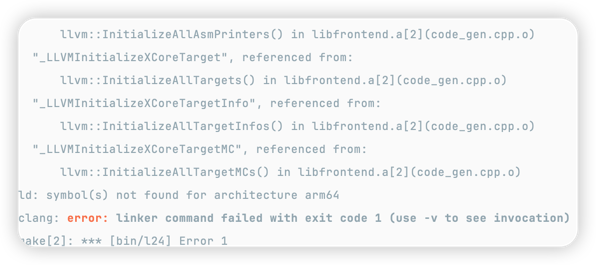

# Antlr4 环境配置

根据以下链接配置 cmake 

[cmake](https://github.com/antlr/antlr4/tree/dev/runtime/Cpp/cmake)

下载 jar 包并将其复制到 `./third_party/antlr/`

[antlr-4.13.1](https://www.antlr.org/download/antlr-4.13.1-complete.jar)


# LLVM 环境配置

```shell
brew install llvm
# 可执行文件的路径
export PATH="/opt/homebrew/Cellar/llvm/18.1.5/bin:$PATH"
# 让编译器能够找到LLVM
export LDFLAGS="-L/opt/homebrew/Cellar/llvm/18.1.5/lib"
export CPPFLAGS="-I/opt/homebrew/Cellar/llvm/18.1.5/include"
```

如果你遇到下述问题,



参考[how-to-use-llvm-target-initialize-function](https://stackoverflow.com/questions/71867265/how-to-use-llvm-target-initialize-function)修改CMakeLists.txt

```cmake
set(LLVM_LINK_COMPONENTS
        ${LLVM_TARGETS_TO_BUILD}
)

llvm_map_components_to_libnames(llvm_libs Core ExecutionEngine IRReader Passes Support TransformUtils native AsmParser ${LLVM_LINK_COMPONENTS})
```

并在使用 cmake build 的时候设置参数:
```shell
cmake .. -DLLVM_TARGETS_TO_BUILD=all  
```


# 参考资料

## Antlr4 

[getting-started-antlr-cpp](https://tomassetti.me/getting-started-antlr-cpp/)

## LLVM

[MyFirstLanguageFrontend](https://llvm.org/docs/tutorial/MyFirstLanguageFrontend/)

[writing-your-own-toy-compiler](https://gnuu.org/2009/09/18/writing-your-own-toy-compiler/)


### LLVM Spec

当使用 Create 创建 BasicBlock 时，第一个 BasicBlock 不可以使用 `func->insert(func->end(), bb)`, 后面的均需使用

```c++
llvm::BasicBlock *thenBB =
    llvm::BasicBlock::Create(*(this->_ctx._context), "then", func);
llvm::BasicBlock *elseBB = llvm::BasicBlock::Create(*(this->_ctx._context), "else");
llvm::BasicBlock *mergeBB = llvm::BasicBlock::Create(*(this->_ctx._context), "ifcont");

// Emit then value.
(this->_ctx._builder)->SetInsertPoint(thenBB);

...

// Emit else block.
func->insert(func->end(), elseBB);
(this->_ctx._builder)->SetInsertPoint(elseBB);

// Emit merge block.
func->insert(func->end(), mergeBB);
(this->_ctx._builder)->SetInsertPoint(mergeBB);
```

当创建新的 BasicBlock, 一定要在 `(this->_ctx._builder)->SetInsertPoint(bb);` 前加上 
```c++
(this->_ctx._builder)->CreateBr(bb); // 或 CreateCondBr, 因为新的 bb 的位置并不一定就是 eip + word_size
```

llvm 不允许两个相连的跳转指令， 参考 [stackoverflow](https://stackoverflow.com/questions/67902111/llvm-ir-cannot-break-out-of-the-loop)
(continue/break 可能会产生两个相连的跳转指令，因此 if 和 while 的 codegen 实现中需要额外判断)

获取当前 BasicBlock 的方法：
```c++
(this->_ctx._builder)->GetInsertBlock()
```

从一个 BasicBlock 中获取最后一个 Instruction 的方法为:
```c++
bb->back();

// 判断是否为 BranchInst
llvm::isa<llvm::BranchInst>(bb->back());
```

当创建函数参数的指令时，注意传递给 CreateStore 的值的参数需要为该参数的地址 `&arg` 
```c++
this->_ctx.defineValue(std::string(arg.getName()), L24Type::ValType::VAR, &arg);
```

clang 连接静态库
```shell
clang -L <dir contains lib> -l <libname>  

# 例如需要连接： ../lib/libsysy.a
clang -L ../lib -l sysy
```

llvm 全局变量相关函数
```c++
// 定义全局变量并设置初始值
_module->getOrInsertGlobal(ident, ty);
auto constantInt =
    llvm::ConstantInt::getIntegerValue(ty,llvm::APInt(64, (llvm::dyn_cast<llvm::ConstantInt>(val)->getSExtValue())));
_module->getGlobalVariable(ident)->setInitializer(constantInt);

// 从全局变量里获取值
llvm::GlobalVariable* key = _module->getGlobalVariable(ident);
return key->getInitializer();

// 设置全局变量的值
key->setInitializer(constantInt);
```


